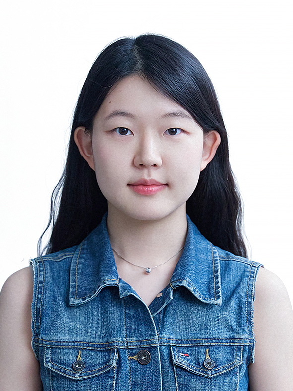

# juheelee-portfolio.github.io
<!DOCTYPE html>
<html lang="ko">
<head>
  <meta charset="UTF-8">
  <meta name="viewport" content="width=device-width, initial-scale=1.0">
  <title>이주희 포트폴리오</title>
  
</head>
<body>

  <!-- 홈 -->
  <header>
    
    <h1> Juhee Lee / 이주희</h1>
    
소통을 잘하는 마케터 이주희입니다.

    
<strong>직무:</strong> Marketing | <strong>전공:</strong> Law, International Exchange

  </header>

  <!-- 소개 -->
  <section>
    <h2>About Me</h2>
    
안녕하세요! 저는 숙명여대 법학과 학생으로, 
      독일 인턴 경험과 해외봉사 경험을 바탕으로 글로벌 마케터로 성장하고 싶습니다.

  </section>

  <!-- 프로젝트 -->
  <section>
    <h2>Projects</h2>
  
    

      

        
독일 장애인 복지 탐구 프로그램

        
2024년 여름, 독일에서 장애인 복지 제도를 연구하고 현지 기관을 탐방했습니다.  
           다양한 문화적 차이를 배우고, 복지정책에 대한 이해를 넓혔습니다.

      

    

    

      

        
태국 교육 봉사

        
2024년 여름, 초중학생 대상 봉사활동을 진행하며 교육적 교류 경험을 쌓았습니다.  
           약 300시간 이상의 봉사 경험을 통해 소통과 협업 능력을 강화했습니다.

      

    

    

      

        
독일 인턴십

        
국제 교류와 다양성을 주제로 한 독일 인턴십에 참여하며 글로벌 협업 경험을 축적했습니다.

      

    

  </section>

  <!-- 스킬 -->
  <section>
    <h2>Skills</h2>
    

      
<strong>언어:</strong> 한국어 (모국어), 영어 (중상급), 독일어 (기초), 중국어 (기초) 

      
<strong>기술:</strong> HTML, CSS, Python(기초)

      
<strong>소프트 스킬:</strong> 커뮤니케이션, 팀워크, 문제 해결

    

  </section>

  <!-- 이력서 -->
  <section>
    <h2>Resume</h2>
    
<a href="resume.pdf" target="_blank">📄 이력서 다운로드</a>

  </section>

  <!-- 연락처 -->
  <section class="contact">
    <h2>Contact</h2>
    
Email: <a href="mailto:juhee@example.com">juhee@example.com</a>

    
<a href="https://www.linkedin.com/" target="_blank">LinkedIn</a> | 
       <a href="https://github.com/" target="_blank">GitHub</a>

  </section>

  <footer>
    
© 2025 Juhee Portfolio

  </footer>

</body>
</html>
